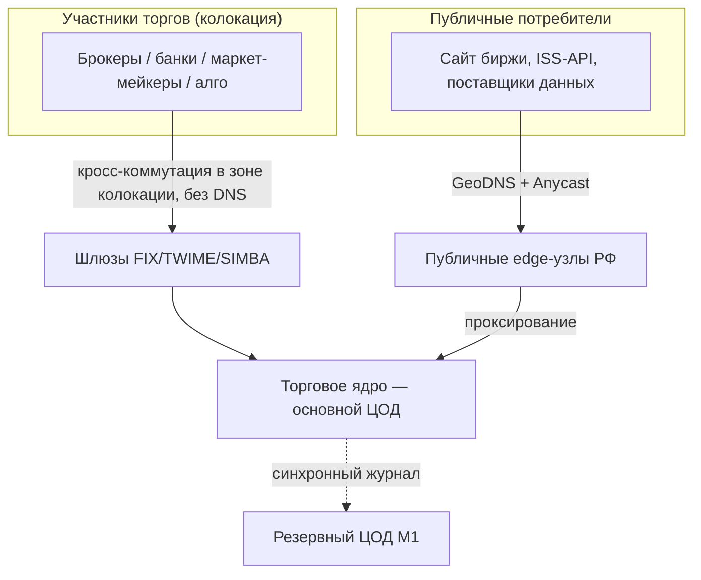
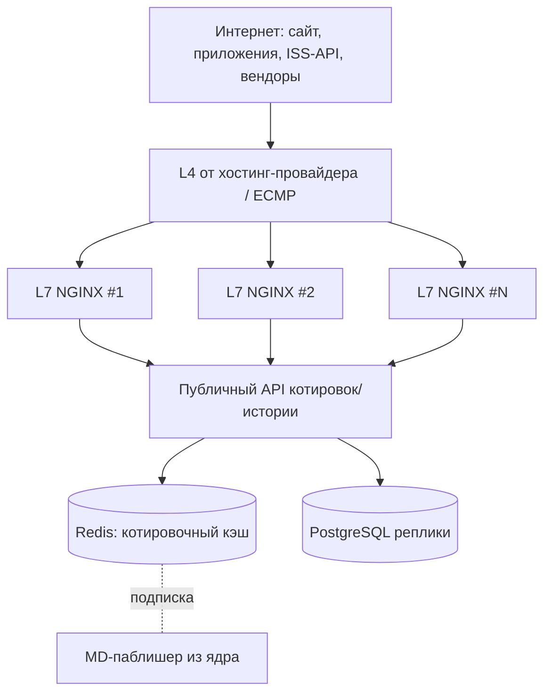
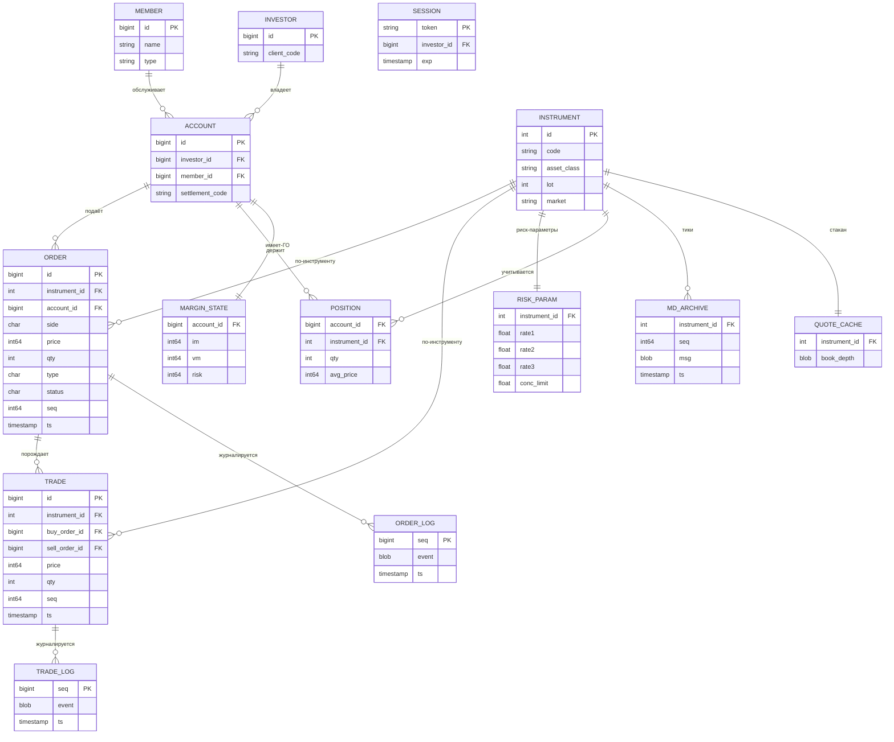
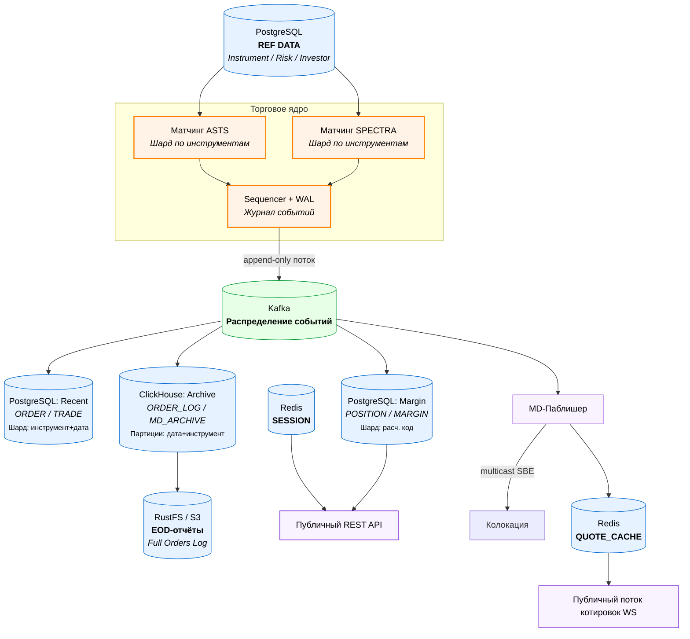
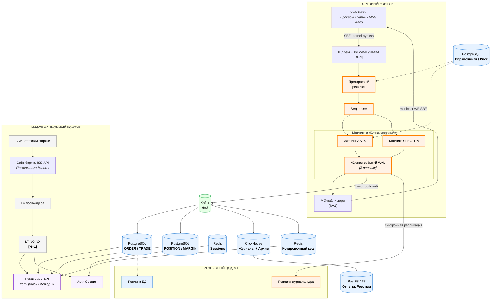

# РПЗ: торговое ядро и сервис рыночных данных биржи (клон Московской биржи)

## Содержание

1. [Тема и целевая аудитория](#1-тема-и-целевая-аудитория)
2. [Расчёт нагрузки](#2-расчёт-нагрузки)
3. [Глобальная балансировка нагрузки](#3-глобальная-балансировка-нагрузки)
4. [Локальная балансировка нагрузки](#4-локальная-балансировка-нагрузки)
5. [Логическая схема БД](#5-логическая-схема-бд)
6. [Физическая схема БД](#6-физическая-схема-бд)
7. [Алгоритмы](#7-алгоритмы)
8. [Технологии](#8-технологии)
9. [Обеспечение надёжности](#9-обеспечение-надёжности)
10. [Схема проекта](#10-схема-проекта)
11. [Список серверов](#11-список-серверов)
12. [Список источников](#список-источников)

---

# 1. Тема и целевая аудитория

## 1.1 Описание и аналоги

Проектируемый сервис - электронная биржа: организатор торгов, который сводит заявки покупателей и продавцов по финансовым инструментам и в реальном времени распространяет рыночные данные. В качестве MVP выбрана главная подсистема - приём заявок, торговое ядро, распространение рыночных данных, преторговый риск-контроль.

Прямые клиенты биржи - это участники торгов (брокеры, банки, дилеры, несколько сотен юр. лиц [[1]](https://www.kp.ru/guide/brokery-moskovskoi-birzhi.html)) и поставщики рыночных данных. Розничные инвесторы к бирже напрямую не подключаются [[2]](https://www.moex.com/s1480).

Аналоги по миру: NASDAQ, CME, LSE.

## 1.2 Целевая аудитория

| Сегмент | Размер | Местоположение |
| :------ | :----: | :------------- |
| Розничные инвесторы | 40,1 млн | РФ, концентрация в Москве, МО, СПБ |
| Активные розничные инвесторы | 3,5 млн | РФ |
| Профессиональные участники (брокеры, банки, маркет-мейкеры) | сотни юр. лиц | Москва |
| Поставщики данных, хедж-фонды | сотни | Москва |

На конец 2025 г. брокерские счета на Московской бирже имели 40,1 млн частных инвесторов, открыто 76 млн счетов [[3]](https://www.moex.com/n76900)[[4]](https://www.moex.com/n98156). В 2025 г. сделки на фондовом рынке заключали 10,2 млн человек, в среднем 3,5 млн в месяц [[4]](https://www.moex.com/n98156)[[5]](https://www.moex.com/n96827). Это более 25% населения РФ [[6]](https://ru.investing.com/analysis/article-200320422). Аудитория почти полностью в РФ с концентрацией в Москве, МО и Санкт-Петербурге [[3]](https://www.moex.com/n76900).

Рекорд дневного числа торгующих физлиц - 1,1 млн человек за сутки [[7]](https://www.rbc.ru/quote/news/article/6419cf369a79479c8c3042df).

## 1.3 Функционал MVP

1. **Выставление заявки** - лимитной или рыночной, на покупку или продажу инструмента.
2. **Снятие и изменение заявки.**
3. **Биржевой стакан и лента сделок в реальном времени.**
4. **Свои заявки и история сделок.**
5. **Портфель** - открытые позиции, доступные средства и требуемое обеспечение.
6. **График и история котировок.**

### Ключевые продуктовые решения

- **Основной сценарий.** Розничный инвестор подаёт заявку через брокера и сразу видит её исполнение и обновление котировок в реальном времени.
- **Анонимный рынок с центральным контрагентом.** Участник торгует не с конкретным контрагентом, а против биржи: исполнение и расчёты гарантирует центральный контрагент (аналог клирингового центра НКЦ у MOEX [[3]](https://www.moex.com/n76900)).
- **Правило приоритета цена-время.** Заявки обрабатываются по правилу: сначала лучшая цена, при равной цене - кто подал раньше (FIFO).
- **Котировки в реальном времени.**
- **Колокация для профессионалов.** Маркет-мейкеры и алго-трейдеры могут разместить своё оборудование в одном дата-центре с торговой системой [[8]](https://www.dataspace.ru/company/press-center/pionery-tsodostroeniya-moskovskaya-birzha-/).

---

# 2. Расчёт нагрузки

## 2.1 Исходные данные

| Параметр | Значение | Источник |
| :------- | :------: | :------- |
| База инвесторов | 40,1 млн | [[3]](https://www.moex.com/n76900)[[4]](https://www.moex.com/n98156) |
| Брокерские счета | 76 млн | [[4]](https://www.moex.com/n98156) |
| MAU (торгующие) | 3,5 млн | [[5]](https://www.moex.com/n96827) |
| Рекорд DAU (торгующие) | 1,1 млн | [[7]](https://www.rbc.ru/quote/news/article/6419cf369a79479c8c3042df) |
| Средн. DAU 2022 | 0,625 млн | [[7]](https://www.rbc.ru/quote/news/article/6419cf369a79479c8c3042df) |
| Среднедневное число сделок (все рынки, 2022) | 4,1 млн | [[9]](https://sr2022.moex.com/ru/1/2/1/index.html) |
| Order-to-trade (по объёму, акции, SEC) | ~3,5%, 25-30:1 | [[10]](https://www.sec.gov/data-research/statistics-data-visualizations/trade-order-volume-ratios) |
| Участников торгов (посредников) | сотни | [[1]](https://www.kp.ru/guide/brokery-moskovskoi-birzhi.html) |
| Время отклика ядра | ~300 мкс | [[11]](https://www.dataspace.ru/company/press-center/it-dlya-investitsionnoy-ekosistemy/) |
| Заявленная ёмкость торговых систем | 38-110 тыс. тх/с | [[11]](https://www.dataspace.ru/company/press-center/it-dlya-investitsionnoy-ekosistemy/) |
| Доступность (5 лет) | 99,97% | [[11]](https://www.dataspace.ru/company/press-center/it-dlya-investitsionnoy-ekosistemy/) |
| Единица производительности шлюза | 30 тх/с | [[12]](https://www.moex.com/s324) |
| Глубина стакана | 10×10 (акции/обл./валюта), 5×5 (срочный) | [[13]](https://www.moex.com/ru/orders) |
| Инструментов на срочном рынке | 267 | [[4]](https://www.moex.com/n98156) |
| Время торгов | 06:50-23:50 | [[14]](https://cifra-broker.ru/help-center/grafik-raboty-moskovskoy-birzhi-vremya-torgov-i-sessiy/) |

## 2.2 Продуктовые метрики

### 2.2.1 MAU, DAU, Sticky Factor

За базовый сценарий: MAU торгующих = 3,5 млн [[5]](https://www.moex.com/n96827). DAU принят как 1,0 млн (рекорд 1,1 млн [[7]](https://www.rbc.ru/quote/news/article/6419cf369a79479c8c3042df), средний 2022 - 0,625 млн; с учётом роста базы к 2025 г. среднее около 1,0 млн). Коэффициент липучести:

$$
SF = \frac{DAU}{MAU} = \frac{1{,}0}{3{,}5} \approx 28{,}6\%
$$

Высокое значение типично для активной торговой аудитории. Это метрики конечных клиентов (розницы) - на биржу их активность приходит агрегированной через сотни участников торгов. Продуктовые метрики и нагрузка на биржу считаются раздельно.

### 2.2.2 Средний размер хранилища пользователя

Оценка на одного торгующего инвестора:

| Сущность | Кол-во записей | Размер записи | Итого |
| :------- | :------------: | :-----------: | :---: |
| Позиции (открытые) | 8 | 64 байта | 512 байт |
| Заявки за день | 13 | 200 байт | 2 600 байт |
| Сделки за день | 6 | 300 байт | 1 800 байт |
| Профиль счёта/риск | 1 | 512 байт | 512 байт |
| **Итого** | | | **≈ 5,4 КБ/день** |

Журналы заявок и сделок хранятся централизованно. Профиль + позиции для всей базы 40,1 млн: $40{,}1 \times 10^6 \times 1{,}1\text{ КБ} \approx 44\text{ ГБ}$.

### 2.2.3 Среднее число действий розничного клиента в день

Это действия конечного инвестора в приложении брокера. Большинство из них брокер обслуживает из своих данных и не передаёт на биржу; биржа получает только поток заявок и снятий в агрегированном виде. Нагрузка на биржу рассчитывается из реального числа сделок, а не из этих оценок.

| Действие | Среднее | Пиковое |
| :------- | :-----: | :-----: |
| Подача заявки | 8 | 25 |
| Снятие/замена заявки | 5 | 18 |
| Запрос/снимок стакана | 40 | 120 |
| Подписка на поток котировок (сессия) | 1,2 | 2 |
| Запрос портфеля/позиций | 15 | 40 |
| Запрос своих сделок/истории | 6 | 15 |
| **Итого** | **75,2** | **220** |

## 2.3 Технические метрики

Система делится на два независимых контура:

- **Торговый контур** - приём заявок от участников, матчинг, быстрая раздача рыночных данных в колокацию. Критичен по задержке: бюджет ~300 мкс [[11]](https://www.dataspace.ru/company/press-center/it-dlya-investitsionnoy-ekosistemy/), рыночные данные раздаются по multicast.
- **Информационный контур** - публичный сайт/API биржи и раздача данных поставщикам. По нагрузке вторичен (массовую раздачу котировок рознице ведут брокеры).

Нагрузка биржи пиковая и чувствительная к задержкам. В кратких всплесках она на порядки выше среднего, при этом рост задержки недопустим. Система проектируется по пиковым значениям.

### 2.3.1 Поток заявок и сделок

За основу берём среднедневное число сделок - 4,1 млн на всех рынках (2022) [[9]](https://sr2022.moex.com/ru/1/2/1/index.html). Число заявок на одну сделку оцениваем через статистику SEC. Публикуемое отношение trade-to-order по акциям ≈ 3,5% считается по объёму бумаг, а не по числу ордеров [[10]](https://www.sec.gov/data-research/statistics-data-visualizations/trade-order-volume-ratios), поэтому напрямую инвертировать его некорректно. Для оценки берём cancel-to-trade ratio (число отмен на сделку), которое исторически составляет ≈ 19-22 [[10]](https://www.sec.gov/data-research/statistics-data-visualizations/trade-order-volume-ratios); с учётом самой сделки это ≈ 20-23 заявки. Принимаем 25 (с запасом на снятия и замены):

$$
N_{orders}/\text{день} = 4{,}1 \times 10^6 \times 25 \approx 1{,}03 \times 10^8 \text{ заявок/день}
$$

Усреднение по сессии 17 ч = 61 200 с:

$$
RPS_{avg} = \frac{1{,}03 \times 10^8}{61\,200} \approx 1\,680 \text{ заявок/с}, \qquad
\lambda_{trades}^{avg} = \frac{4{,}1\times10^6}{61\,200} \approx 67 \text{ сделок/с}
$$

Пиковую ёмкость берём по заявленной MOEX протестированной пропускной способности [[11]](https://www.dataspace.ru/company/press-center/it-dlya-investitsionnoy-ekosistemy/):

| Параметр | Значение | Источник / обоснование |
| :------- | :------: | :--------------------- |
| Средний поток заявок | ~1 680 тх/с | из [[9]](https://sr2022.moex.com/ru/1/2/1/index.html)+[[10]](https://www.sec.gov/data-research/statistics-data-visualizations/trade-order-volume-ratios) |
| Средний поток сделок | ~67 сделок/с | из [[9]](https://sr2022.moex.com/ru/1/2/1/index.html) |
| Пиковая ёмкость (на рынок) | 38 000 тх/с | нижняя граница [[11]](https://www.dataspace.ru/company/press-center/it-dlya-investitsionnoy-ekosistemy/) |
| Пиковая ёмкость (максимум) | 110 000 тх/с | верхняя граница [[11]](https://www.dataspace.ru/company/press-center/it-dlya-investitsionnoy-ekosistemy/) |
| Проектная цель (агрегат, запас на рост) | 150 000 тх/с | +36% к 110k |

Отношение пик/среднее очень высокое - это норма для биржи. Требование: детерминированные ~300 мкс при любой нагрузке [[11]](https://www.dataspace.ru/company/press-center/it-dlya-investitsionnoy-ekosistemy/).

По данным MOEX, система обрабатывает до 250 млн заявок в день и 140 тыс. тх/с при времени обработки 200-300 мкс [[15]](https://www.tadviser.ru/index.php/Статья:Информационные_технологии_в_Московской_бирже); инженеры биржи приводили реальные профили нагрузки с пиками до ~200 тыс. тх/с в коротком окне [[16]](https://habr.com/ru/companies/moex/articles/444300/).

### 2.3.2 Сетевой трафик

Размеры сообщений приняты как оценка по составу полей бинарного протокола:
- заявка/снятие - ~50 байт (тип, seq, инструмент, цена, объём, флаги, счёт, ts);
- сообщение рыночных данных (инкремент стакана / сделка) - ~48 байт;
- количество событий рыночных данных на заявку - ~2.

**(а) Рыночные данные (multicast).**

$$
MD^{peak} = 110\,000 \times 2 = 220\,000 \text{ сообщ/с}
$$
$$
B_{MD} = 220\,000 \times 48\text{ Б} \approx 10{,}6 \text{ МБ/с} \approx 84 \text{ Мбит/с}
$$

Multicast отдаёт одну копию на канал независимо от числа получателей. Полученные 84 Мбит/с - пик одного инкрементального фида. Реальная биржа раздаёт несколько сегментных фидов (по торговым системам и классам активов), каждый дублируется в независимые **A/B-потоки**. Суммарно по всем инкрементальным и snapshot-каналам закладываем ≈ **1,5-2 Гбит/с**. Этот объём не растёт с числом подписчиков.

**(б) Приём заявок.**
$$
B_{in}^{peak} = 110\,000 \times 50\text{ Б} \approx 5{,}5 \text{ МБ/с} \approx 44 \text{ Мбит/с}
$$

**(в) Информационный контур.** Основную раздачу котировок рознице ведут брокеры. Консервативная оценка публичного сервиса биржи:

| Параметр | Оценка | Примечание |
| :------- | :----: | :--------- |
| Пиковый публичный RPS | 30 000 | допущение |
| Одновременных соединений | ~150 000 | допущение |
| Средний ответ | ~5 КБ | снимок стакана/котировки |
| Пиковый egress | ~3 Гбит/с | $30\,000 \times 5\text{ КБ} \times 8$ |

| Тип трафика | Контур | Средн. | Пик |
| :---------- | :----- | :----: | :-: |
| Рыночные данные | торговый | ~1 Гбит/с | ~2 Гбит/с |
| Приём заявок | торговый | малый объём, высокий PPS | ~44 Мбит/с |
| Информационный контур | информационный | ~0,8 Гбит/с | ~3 Гбит/с |

### 2.3.3 Хранение по типам данных

~1,03·10⁸ заявок/день, 4,1·10⁶ сделок/день, ~2,06·10⁸ событий рыночных данных/день.

| Блок данных | Объём/день | Архив (5 лет, ~1260 торг. дней) | Хранилище |
| :---------- | :--------: | :-----------------------------: | :-------- |
| Журнал заявок (~64 Б) | $1{,}03\!\cdot\!10^8 \times 64\text{Б} \approx 6{,}6$ ГБ | ≈ 8,3 ТБ | ClickHouse |
| Журнал сделок (~64 Б) | $4{,}1\!\cdot\!10^6 \times 64\text{Б} \approx 0{,}26$ ГБ | ≈ 0,33 ТБ | ClickHouse |
| Архив рыночных данных (тики, ~48 Б) | $2{,}06\!\cdot\!10^8 \times 48\text{Б} \approx 9{,}9$ ГБ | ≈ 12,5 ТБ (до сжатия; продаётся как продукт) | ClickHouse (сжатие ~8-10×) |
| Справочники (инструменты ~3 000, риск-параметры) | < 1 ГБ | - | PostgreSQL + in-memory |
| Реестр клиентов и позиции (коды клиентов ~40 млн) | ~50 ГБ | актуальный срез | PostgreSQL |
| Котировочный кэш (стаканы) | в памяти | - | Redis |
| EOD-отчёты, реестры сделок/заявок (продукты) | единицы ГБ/день | архив | RustFS (S3) |

### 2.3.4 Сводная таблица RPS (средний / пиковый)

| Запрос | Контур | RPS средн. | RPS пик | Источник / прим. |
| :----- | :----- | :--------: | :-----: | :--------------- |
| Подача/снятие заявки | торговый | 1 680 | 110 000 | средн. [[9]](https://sr2022.moex.com/ru/1/2/1/index.html)+[[10]](https://www.sec.gov/data-research/statistics-data-visualizations/trade-order-volume-ratios); пик [[11]](https://www.dataspace.ru/company/press-center/it-dlya-investitsionnoy-ekosistemy/) |
| Преторговый риск-чек (на заявку) | торговый | 1 680 | 110 000 | в пути заявки |
| Генерация событий рыночных данных | торговый | ~3 400 | 220 000 | multicast, ×2 к заявкам |
| Публичный снимок/котировки (API) | информац. | 8 000 | 30 000 | допущение |
| Публичный портфель/история | информац. | 2 000 | 8 000 | допущение |
| Аутентификация/сессии | информац. | 800 | 4 000 | допущение |

### Сводная таблица продуктовых метрик

| Метрика | Значение | Источник |
| :------ | :------: | :------- |
| База инвесторов | 40,1 млн | [[3]](https://www.moex.com/n76900)[[4]](https://www.moex.com/n98156) |
| MAU (торгующие) | 3,5 млн | [[5]](https://www.moex.com/n96827) |
| DAU (торгующие) | 1,0 млн (пик 1,1 млн) | [[7]](https://www.rbc.ru/quote/news/article/6419cf369a79479c8c3042df) |
| SF | 28,6% | расчёт |
| Среднедневное число сделок | 4,1 млн | [[9]](https://sr2022.moex.com/ru/1/2/1/index.html) |
| Средний поток заявок | ~1 680 тх/с | [[9]](https://sr2022.moex.com/ru/1/2/1/index.html)+[[10]](https://www.sec.gov/data-research/statistics-data-visualizations/trade-order-volume-ratios) |
| Пиковая ёмкость ядра | 110 тыс. тх/с | [[11]](https://www.dataspace.ru/company/press-center/it-dlya-investitsionnoy-ekosistemy/) |
| Участников торгов | сотни | [[1]](https://www.kp.ru/guide/brokery-moskovskoi-birzhi.html) |

---

# 3. Глобальная балансировка нагрузки

## 3.1 Биржа - одно-региональная система

В отличие от обычного B2C-сервиса, биржа не распределяет торговое ядро по регионам: это нарушило бы честность матчинга и колокацию.

Архитектура сводится к схеме "основной ЦОД + горячий резервный ЦОД" в пределах Москвы плюс отдельная раздача публичного информационного сервиса.

## 3.2 Функциональное разбиение по доменам

| Запрос | Домен | Контур |
| :----- | :---- | :----- |
| Подача заявки (FIX/TWIME/native) | `fix.exchange.ru`, `twime.exchange.ru` | торговый |
| Спонсируемый доступ | прямое подключение к ТКС | торговый |
| Рыночные данные | multicast-группы (без DNS) | торговый |
| Публичные котировки/история | `api.exchange.ru` | информационный |
| Статика (веб, графики) | `static.exchange.ru` (CDN) | информационный |
| Аутентификация публичного сервиса | `auth.exchange.ru` | информационный |

## 3.3 Расположение ЦОД

Как у MOEX: основной ЦОД **DataSpace1** и резервный **M1 / NORD6** [[17]](https://www.moex.com/n6737)[[18]](https://www.moex.com/s154)[[19]](https://www.dataspace.ru/data-center/). Колокация только в основном ЦОД [[8]](https://www.dataspace.ru/company/press-center/pionery-tsodostroeniya-moskovskaya-birzha-/).

| ЦОД | Роль |
| :-- | :--- |
| DataSpace1 (Москва) | Основной: ядро, колокация, шлюзы, риск, БД-мастера |
| M1 / NORD6 (Москва) | Горячий резерв: реплика ядра по журналу, реплики БД |
| Публичный edge/CDN (РФ) | Публичный сайт и статика ближе к пользователям |

### Влияние на продуктовые метрики

| Метрика | Влияние выбора |
| :------ | :------------- |
| Задержка ядра (300 мкс) | Колокация + один ЦОД минимизируют задержку для участников |
| Доступность 99,97% | Горячий резервный ЦОД обеспечивает быстрый переход на резерв |
| Удобство публичного сервиса | Публичный edge снижает задержку котировок на сайте/в API |

## 3.4 Распределение запросов по ЦОД

| Запрос | Куда | Доля |
| :----- | :--- | :--: |
| Заявки, матчинг, риск, источник рыночных данных | Основной ЦОД | 100% (резерв в горячем standby) |
| Публичный сайт/ISS-API | Edge-узлы (РФ) с проксированием в основной ЦОД | ~100% |
| Статика, графики | CDN | кэшируется |

## 3.5 Схема балансировки



- **Колокация**: без DNS, прямая кросс-коммутация внутри зоны к шлюзам.
- **Публичный контур**: GeoDNS + Anycast для выбора ближайшего edge-узла; переключение на резервный edge при отказе.
- **Между ЦОД**: основной активен, резервный получает синхронный поток журнала событий ядра.

---

# 4. Локальная балансировка нагрузки

Два контура балансируются по-разному.

## 4.1 Торговый контур (шлюзы заявок)

Используются специализированные шлюзы (FIX/TWIME/native, SIMBA для рыночных данных), как у MOEX [[20]](https://www.moex.com/a7896). Очерёдность FIFO гарантируется на уровне шлюза [[21]](https://www.moex.com/s3820). Балансировка - распределение участников по пулу шлюзов; резервирование N+1 (участник подключён к нескольким шлюзам).

**Расчёт числа шлюзов** (ограничитель - пиковый поток заявок, пропускная способность одного шлюза ~25 000 тх/с):

$$
N_{gw} = \left\lceil \frac{110\,000}{25\,000} \right\rceil = 5 \quad\Rightarrow\quad \text{с резервом } N{+}1 = 6
$$

## 4.2 Информационный контур (L7 для публичного сервиса)



- **L4** - на стороне хостинг-провайдера; биржа держит свои **L7** (NGINX) для TLS-терминации и маршрутизации по доменам.
- **Резервирование**: N+1.

## 4.3 Расчёт количества L7-балансировщиков

Входные данные (пик информационного контура, §2.3.2):

| Характеристика | Значение | Источник |
| :------------- | :------: | :------- |
| Пиковый публичный egress | ~3 Гбит/с | §2.3.2 |
| Одновременных соединений | ~150 000 | §2.3.2 |
| Пиковый публичный RPS | 30 000 | §2.3.4 |
| Доля новых TLS в пике `k_new` | 0,25 | допущение |
| Целевая загрузка узла `u` | 0,5 | [[22]](https://blog.nginx.org/blog/testing-performance-nginx-ingress-controller-kubernetes) |
| Сеть на сервер L7 | 25 Гбит/с | bare-metal [[23]](https://yandex.cloud/ru/services/baremetal) |
| Падение от NGINX | ~12% | [[22]](https://blog.nginx.org/blog/testing-performance-nginx-ingress-controller-kubernetes)[[24]](https://blog.nginx.org/blog/testing-the-performance-of-nginx-and-nginx-plus-web-servers) |
| Соединений на сервер | ~200 000 | предел NGINX |
| NGINX HTTPS CPS (16 ядер) | ~7 300 /с | [[24]](https://blog.nginx.org/blog/testing-the-performance-of-nginx-and-nginx-plus-web-servers) |

**1) Ограничитель TLS:**
$$
TLS_{CPS} = 30\,000 \times 0{,}25 = 7\,500 \text{ CPS}, \quad CPS_{eff} = 7\,300 \times 0{,}5 = 3\,650, \quad N_{ssl} = \left\lceil \frac{7\,500}{3\,650} \right\rceil = 3
$$

**2) Ограничитель сети:**
$$
N_{net} = \left\lceil \frac{3}{25 \times 0{,}88} \right\rceil = 1
$$

**3) Ограничитель соединений:**
$$
N_{conn} = \left\lceil \frac{150\,000}{200\,000} \right\rceil = 1
$$

**Итог:** определяющий фактор - TLS. $N = \max(3;1;1) = 3$, с резервом **N+1 = 4**.

| Ограничитель | Узлов |
| :----------- | :---: |
| TLS | 3 |
| Сеть | 1 |
| Соединения | 1 |
| **Итог (N+1)** | **4** |

Итого **4 L7-балансировщика** на информационный контур (меньше чем у B2C-аналогов, потому что массовую раздачу рознице ведут брокеры).

---

# 5. Логическая схема БД

## 5.1 Логическая схема



## 5.2 Описание таблиц, размеры и нагрузка

| Таблица | Описание | Строк | Запись QPS (пик) | Чтение QPS (пик) | Консистентность |
| :------ | :------- | :---: | :--------------: | :--------------: | :-------------: |
| INSTRUMENT | Справочник инструментов | ~3 000 | редко | очень часто (кэш) | Strong |
| RISK_PARAM | Риск-ставки НКЦ | ~3 000 | вечер + интрадей | на каждую заявку | Strong |
| MEMBER | Участники торгов | сотни | редко | часто | Strong |
| INVESTOR | Клиенты-физлица (коды клиентов) | 40,1 млн | низкая | средняя | Strong |
| ACCOUNT | Счета/расчётные коды | 76 млн | низкая | высокая | Strong |
| ORDER | Активные + дневные заявки | ~0,1 млрд/день | 110 000 | 20 000 | Strong |
| TRADE | Сделки | ~4,1 млн/день | 110 000 (пик) | 8 000 | Strong |
| POSITION | Позиции | ~300 млн | 110 000 (по сделкам) | 6 000 | Strong |
| MARGIN_STATE | ГО/вариационная маржа по счёту | 76 млн | 110 000 (риск-чек) | 110 000 | Strong |
| ORDER_LOG | Журнал заявок (audit) | append, ~8 ТБ/5 лет | 110 000 | аналитика | Strong |
| TRADE_LOG | Журнал сделок | append, ~0,3 ТБ/5 лет | 110 000 | аналитика | Strong |
| QUOTE_CACHE | Стаканы (10×10 / 5×5) | ~3 000 | 220 000 | высокая | Eventual |
| MD_ARCHIVE | Архив тиков | ~12,5 ТБ/5 лет | 220 000 | пакетно | Eventual |
| SESSION | Публичные сессии | ~150 тыс. | 4 000 | 30 000 | Eventual |

## 5.3 Требования к согласованности

- **Strong** (полная согласованность). ORDER, TRADE, POSITION, MARGIN_STATE, ORDER_LOG, TRADE_LOG - ядро не может терять, дублировать или переставлять заявки; матчинг - единственный источник истины. Реализуется через однопоточное ядро с детерминированной обработкой + журнал событий с синхронной репликацией.
- **Eventual** (отложенная согласованность). QUOTE_CACHE, MD_ARCHIVE, SESSION - публичные потребители допускают задержку котировок в единицы-десятки мс.

## 5.4 Особенности распределения нагрузки по ключам

| Таблица | Ключ | Характер |
| :------ | :--- | :------- |
| ORDER / TRADE | instrument_id | Сильный перекос: "голубые фишки" (SBER, GAZP, LKOH [[3]](https://www.moex.com/n76900)) и фьючерс на индекс дают непропорционально много событий |
| POSITION / ACCOUNT | account_id / settlement_code | Относительно равномерно, перекос в сторону крупных участников |
| QUOTE_CACHE | instrument_id | Тот же перекос: топ-инструменты читаются на порядки чаще |
| INVESTOR | id | Равномерно |

Шардирование ядра и БД заявок/сделок по инструменту; самые ликвидные инструменты выделяются на отдельные узлы матчинга, чтобы один горячий инструмент не перегружал шард.

---

# 6. Физическая схема БД

## 6.1 Физическая схема



## 6.2 Выбор СУБД, шардирование и резервирование (потаблично)

| Таблица | СУБД / хранилище | Шардирование | Резервирование |
| :------ | :--------------- | :----------- | :------------- |
| Стакан (in-mem) | Собственное ядро (C++) | По инструменту (горячие - отдельно) | Primary + горячий standby по журналу, синхронная репликация в резервный ЦОД |
| ORDER_LOG / TRADE_LOG (WAL) | Журнал событий (append-only) + Kafka | По партиции рынка | 3 реплики (кворум), реплика в резервном ЦОД |
| ORDER / TRADE (recent) | PostgreSQL | По инструменту + дате | 1 master + 2 реплики (чтение) |
| POSITION / MARGIN_STATE | PostgreSQL | По расчётному коду | 1 master + 2 реплики |
| INSTRUMENT / RISK_PARAM / INVESTOR / MEMBER | PostgreSQL | - (реплицируется на все узлы ядра) | 1 master + 2 реплики, локальные read-копии |
| ORDER_LOG / TRADE_LOG / MD_ARCHIVE (аналитика/архив) | ClickHouse | По дате + инструменту | 1 реплика на партицию |
| QUOTE_CACHE | Redis | По инструменту (хэш-слоты) | 5 master + 5 slave |
| SESSION | Redis | По токену | кластер master/slave |
| EOD/отчёты/full_orders_log | RustFS (S3) | - | erasure coding 4+2 |

## 6.3 Индексы

| Таблица | Индексы |
| :------ | :------ |
| ORDER | PK(id), IDX(instrument_id, status), IDX(account_id, ts) |
| TRADE | PK(id), IDX(instrument_id, ts), IDX(buy_order_id), IDX(sell_order_id) |
| POSITION | PK(account_id, instrument_id) |
| MARGIN_STATE | PK(account_id) |
| ACCOUNT | PK(id), IDX(investor_id), IDX(settlement_code) |
| INSTRUMENT | PK(id), IDX(code) |
| MD_ARCHIVE | первичный ключ ClickHouse (instrument_id, seq) ORDER BY (date, instrument_id) |

## 6.4 Денормализация

- В **QUOTE_CACHE** хранится уже агрегированный стакан 10×10/5×5 - рознице нужны только верхние уровни, а не полный список заявок.
- В **TRADE** дублируются instrument_id и цена/объём, чтобы публичная лента сделок читалась без JOIN.
- **RISK_PARAM** реплицируется в память каждого узла матчинга и риск-чека - нулевая задержка на преторговый контроль.

## 6.5 Подключения к хранилищам

| Хранилище | Подключение |
| :-------- | :---------- |
| PostgreSQL | PgBouncer (transaction pooling), разделение master/replica |
| Redis | redis-cluster client, pipelining |
| Kafka | идемпотентный producer, группы потребителей по сервисам |
| Ядро | бинарный протокол SBE поверх kernel-bypass (DPDK/onload) |

## 6.6 Схема резервного копирования

| Данные | Резервное копирование |
| :----- | :-------------------- |
| Журнал событий ядра | Синхронная репликация в резервный ЦОД + дневной снапшот в S3 |
| PostgreSQL | WAL-archiving непрерывно + pg_basebackup раз в сутки, RAID 6 |
| ClickHouse | Реплики + дневной бэкап партиций в S3 |
| Redis | Восстанавливается из потока событий (кэш), RDB-снапшот раз в час |
| S3/RustFS | Erasure coding 4+2, гео-копия в резервный ЦОД |

---

# 7. Алгоритмы

## 7.1 Матчинг (price-time priority, FIFO)

### Задача
Реализовать правило приоритета "цена-время". Сводить входящие заявки по одному инструменту так, чтобы при пересечении цен покупки и продажи заключалась сделка с приоритетом: сначала по цене (лучшая цена обслуживается первой), затем по времени (FIFO внутри ценового уровня). Бюджет задержки - единицы-десятки микросекунд (отклик платформы ~300 мкс включает сеть и риск-чек) [[11]](https://www.dataspace.ru/company/press-center/it-dlya-investitsionnoy-ekosistemy/).

### Входные данные и ограничения
- Вход: поток заявок (новая limit/market, снятие, замена), упорядоченный sequencer'ом (монотонный `seq`).
- Ограничения: детерминизм (одинаковый вход → одинаковый выход на primary и репликах), отсутствие потерь/дублей, ценовые коридоры.
- Результат: сделки + обновления стакана + подтверждения, всё с монотонным `seq` для воспроизводимости.

### Структуры данных
Стакан - две стороны:
- **bid** - отсортирован по убыванию цены, **ask** - по возрастанию;
- каждый ценовой уровень - FIFO-очередь заявок (двусвязный список / кольцевой буфер);
- индекс "цена → уровень" (отсортированный массив или skip-list).

Доступ к лучшей цене - O(1); вставка на новый уровень - O(log P), где P - число уровней (невелико).

### Последовательность работы (упрощённо)
```
on_new_limit_order(o):
    seq = sequencer.next()
    if o.side == BUY:
        while o.qty > 0 and ask.best_price <= o.price:
            level = ask.best_level()
            maker = level.front()
            traded = min(o.qty, maker.qty)
            emit_trade(o, maker, ask.best_price, traded, seq)   # цена мейкера
            o.qty -= traded; maker.qty -= traded
            if maker.qty == 0: level.pop_front()
            if level.empty(): ask.remove_best()
        if o.qty > 0: bid.insert(o)        # остаток в стакан
    else: # симметрично для SELL по bid
    emit_book_delta(seq)                   # инкремент в MD-фид
    log_event(seq)                         # в журнал (персистирование)
```

### Альтернативы и обоснование выбора
| Вариант | Минус | Решение |
| :------ | :---- | :------ |
| Матчинг в реляционной БД (SQL) | мс-задержки, недетерминизм блокировок | отклонён |
| Многопоточный матчинг одного инструмента | гонки, нарушение FIFO | отклонён |
| **In-memory, однопоточно на инструмент + sequencer + event sourcing** | требует репликации журнала | **выбран** (соответствует разделению матчинг/персистирование MOEX [[20]](https://www.moex.com/a7896)) |

Масштабирование - шардирование по инструментам между движками (горячие инструменты на отдельных узлах). Надёжность - синхронная запись журнала и репликация в горячий standby; повтор того же входа даёт то же состояние.

### Влияние на физическую схему и нагрузку
- Состояние стакана - в памяти, не в БД.
- Журнал событий - главный потребитель записи (110 тыс. событий/с), ClickHouse + Kafka.
- Инкременты рыночных данных - основной множитель сетевого трафика.

## 7.2 Расчёт гарантийного обеспечения (ГО)

### Задача
Перед постановкой заявки убедиться, что у участника достаточно обеспечения с учётом риска всего портфеля, и пересчитывать ГО/вариационную маржу по клиринговым сессиям. Метод соответствует портфельному маржированию НКЦ (аналог SPAN) [[25]](https://www.nationalclearingcentre.ru/catalog/030902)[[26]](https://www.moex.com/s1552)[[27]](https://www.moex.com/s1573).

### Входные данные и ограничения
- Позиции участника по инструментам, риск-параметры НКЦ: ставки рыночного риска 1/2/3 уровня, лимиты концентрации, ставки волатильности, спред-льготы [[25]](https://www.nationalclearingcentre.ru/catalog/030902).
- Параметры статические (минимальные уровни) + динамические (пересчёт вечером после торгов и интрадей при пробое границ) [[26]](https://www.moex.com/s1552).

### Последовательность работы
1. Сформировать набор сценариев изменения цены/волатильности базовых активов (сетка шоков по ставкам риска 1/2/3 уровня).
2. Для каждого сценария рассчитать P&L портфеля с учётом взаимозачёта рисков: убыток по одним инструментам компенсируется прибылью по другим [[27]](https://www.moex.com/s1573).
3. Требуемое ГО = максимальный убыток по наихудшему сценарию + надбавки [[25]](https://www.nationalclearingcentre.ru/catalog/030902).
4. **Преторговый риск-чек**: инкрементально пересчитать ГО с гипотетической новой позицией; если свободных средств хватает - заявка допускается в матчинг, иначе отклоняется.
5. Вариационная маржа списывается/начисляется по клиринговым сессиям (дневной перерыв 14:00-14:05, вечерний 18:50-19:05) [[14]](https://cifra-broker.ru/help-center/grafik-raboty-moskovskoy-birzhi-vremya-torgov-i-sessiy/).

### Структуры данных
Портфель - вектор позиций; сценарии - матрица шоков; результат - `IM` (начальная маржа / ГО), `VM` (вариационная маржа). Уровни расчёта: расчётный код / брокерская фирма / клиент [[27]](https://www.moex.com/s1573).

### Альтернативы и обоснование
| Вариант | Минус | Решение |
| :------ | :---- | :------ |
| Полный Монте-Карло на каждую заявку | сотни мс - не укладывается в бюджет преторгового чека | отклонён (только для стресс-тестов) |
| Фиксированная маржа на контракт | игнорирует портфельные взаимозачёты, завышает требования | отклонён |
| **Сценарная сетка (SPAN-подобная) + инкрементальный чек** | требует свежих риск-параметров в памяти | **выбран** |

### Влияние на физическую схему и нагрузку
- RISK_PARAM и позиции хранятся в памяти узлов риск-чека (§6.4) → преторговый чек укладывается в бюджет 300 мкс.
- Риск-чек выполняется на каждую заявку → 110 тыс. оп/с (§2.3.4), масштабируется вместе с ядром.
- Динамический пересчёт интрадей создаёт периодические всплески чтения позиций (§5.2).

---

# 8. Технологии

Ядро разделено на две системы по классам активов - это повторяет архитектуру MOEX: ASTS (фондовый/валютный/денежный рынки) и SPECTRA (срочный рынок) [[28]](https://www.moex.com/s63).

| Технология | Область применения | Мотивация |
| :--------- | :----------------- | :-------- |
| C++ | Торговое ядро, матчинг, риск-чек | Минимальная и предсказуемая задержка, контроль аллокаций |
| Rust / C++ | Шлюзы FIX/TWIME/SIMBA | Производительность + безопасность памяти |
| SBE (Simple Binary Encoding) | Протокол заявок и рыночных данных | Бинарный формат - стандарт для рыночных данных бирж [[20]](https://www.moex.com/a7896) |
| Kernel-bypass (DPDK / Solarflare onload) | Сетевой стек колокации | Обход ядра ОС, снижение задержки на десятки мкс |
| IP Multicast (PIM/IGMP), A/B-фиды | Распространение рыночных данных | Раздача без роста полосы от числа подписчиков |
| Kafka | Распределение событий ядра downstream | Высокая пропускная способность, надёжное хранение, группы потребителей |
| PostgreSQL | Заявки/сделки (recent), позиции, маржа, справочники | Транзакции, строгая согласованность, реплики |
| ClickHouse | Журналы и архив тиков | Колоночное сжатие ~8-10× для аналитики/архива |
| Redis | Котировочный кэш, публичные сессии | Высокий RPS, кластеризация |
| Go | Публичные REST/WS-сервисы | Поддержка миллионов одновременных соединений (goroutines) |
| WebSocket | Публичный поток котировок | Push-уведомления рознице без поллинга |
| RustFS (S3) | EOD-отчёты, full_orders_log, архив | Open-source, self-hosted, erasure coding |
| Kubernetes | Только информационный контур | Автоскейл публичного API/WS; ядро - bare-metal вне k8s |
| NGINX | L7 публичного контура | TLS-терминация, WS-проксирование |
| PTP (Precision Time Protocol) | Синхронизация времени | Точные таймстемпы заявок для FIFO и аудита |

---

# 9. Обеспечение надёжности

## 9.1 Сводная таблица резервирования

| Компонент | Способ резервирования |
| :-------- | :-------------------- |
| Торговое ядро (матчинг) | Primary + горячий standby (active-passive), детерминированный replay журнала; реплика в резервном ЦОД (M1) |
| Sequencer / журнал событий | 3 реплики по кворуму, синхронная запись |
| Шлюзы FIX/TWIME/SIMBA | N+1, участник подключён к нескольким шлюзам [[21]](https://www.moex.com/s3820) |
| MD-паблишеры | N+1 + дублированные A/B multicast-фиды |
| Риск-чек | N+1, копия RISK_PARAM/позиций в памяти |
| PostgreSQL | 1 master + 2 реплики, WAL-archiving, RAID 6 |
| ClickHouse | 1 реплика на партицию |
| Redis (кэш/сессии) | 3 master + 3 slave, восстановление из потока |
| Kafka | replication factor 3 |
| Публичный API/WS | k8s Deployment, N+1, 3 зоны доступности |
| L7 NGINX | N+1 (§4.3) |
| RustFS (S3) | Erasure coding 4+2, гео-копия |
| ЦОД | Основной DataSpace1 + горячий резерв M1 [[17]](https://www.moex.com/n6737)[[18]](https://www.moex.com/s154) |

## 9.2 Поведение при отказах

| Отказ | Что происходит |
| :---- | :------------- |
| Падение primary-ядра | Promote standby (replay журнала), пауза торгов на секунды |
| Отказ одного шлюза | Участники переключаются на резервный шлюз (N+1) |
| Отказ MD-паблишера | Подписчики переходят на B-фид; снимок из snapshot-канала |
| Падение Redis-кэша | Публичные котировки восстанавливаются из потока; деградация до REST-снимков |
| Падение публичного API | Колокация и матчинг не затронуты; розница теряет графики/портфель |
| Потеря основного ЦОД | Переключение на резервный ЦОД по синхронному журналу |
| Падение реплики PostgreSQL | Чтение перенаправляется на master/другую реплику |

## 9.3 Мониторинг

Метрики задержки матчинга (p50/p99/p999), темп заявок/сделок, лаг журнала и репликации, заполнение очередей шлюзов, число WS-соединений, разрывы multicast (gap detection по `seq`).

---

# 10. Схема проекта



## 10.1 Пояснения к схеме

**Потоки данных.**
1. Участник торгов шлёт заявку (SBE) → преторговый риск-чек → sequencer присваивает `seq` → матчинг соответствующего рынка.
2. Матчинг порождает сделки и инкременты стакана → журнал событий (durable) → MD-паблишеры → multicast обратно в колокацию (A/B-фиды).
3. Журнал асинхронно вытекает в Kafka → PostgreSQL (заявки/сделки/позиции/маржа), ClickHouse (журналы + архив), Redis (котировочный кэш).
4. Публичный сайт/ISS-API отдаёт котировки из Redis и историю из PostgreSQL. Массовую раздачу котировок конечным клиентам ведут брокеры (вне периметра проекта).

**Балансировка.**
- Торговый контур: прямая кросс-коммутация к шлюзам (N+1, FIFO), без L7.
- Информационный контур: GeoDNS + Anycast → L4 (провайдер) → L7 NGINX (N+1) → сервисы (k8s).
- Межсервисная: PgBouncer перед PostgreSQL, redis-cluster, группы потребителей Kafka.

**Разделение контуров** гарантирует, что нагрузка на публичный сервис не влияет на задержку матчинга для участников торгов.

---

# 11. Список серверов

## 11.1 Требования к ресурсам по сервисам

| Сервис | Нагрузка | CPU | RAM | Диск | Сеть |
| :----- | :------: | :-: | :-: | :--: | :--: |
| Матчинг ASTS | до 70k тх/с пик | высокочастотные 8 ядер | 256 ГБ | NVMe 2 ТБ | 25 Гбит |
| Матчинг SPECTRA | до 40k тх/с пик | высокочастотные 8 ядер | 256 ГБ | NVMe 2 ТБ | 25 Гбит |
| Шлюзы FIX/TWIME/SIMBA | до 110k тх/с пик | 16 | 64 ГБ | 500 ГБ | 25 Гбит |
| Риск-чек | до 110k оп/с пик | 32 | 256 ГБ | 500 ГБ | 25 Гбит |
| MD-паблишеры | до 220k сообщ/с пик | 16 | 64 ГБ | 500 ГБ | 25 Гбит |
| ClickHouse | архив ~12,5 ТБ/5 лет | 32 | 256 ГБ | 20 ТБ | 25 Гбит |
| PostgreSQL (заявки/сделки) | 110k w пик | 64 | 256 ГБ | 8 ТБ NVMe | 25 Гбит |
| PostgreSQL (позиции/маржа) | 110k w пик | 32 | 128 ГБ | 2 ТБ | 10 Гбит |
| Redis (кэш стаканов) | push в публичный API | 32 | 128 ГБ | - | 25 Гбит |
| Публичный API/WS | 30k RPS, ~150k соед. | 16 | 32 ГБ | - | 10 Гбит |
| L7 NGINX | ~3 Гбит/с, 7,5k CPS | 16 | 32 ГБ | - | 25 Гбит |
| RustFS (S3) | архив | 16 | 64 ГБ | 100 ТБ | 25 Гбит |

## 11.2 Сводная таблица серверов

| Сервис | Тип | Конфигурация | Кол-во | Резервирование |
| :----- | :-: | :----------- | :----: | :------------- |
| Матчинг ASTS | Bare | 8 ядер @5ГГц / 256 ГБ / 2 ТБ NVMe | 6 | 3 шарда × (primary+standby) |
| Матчинг SPECTRA | Bare | 8 ядер @5ГГц / 256 ГБ / 2 ТБ NVMe | 4 | 2 шарда × (primary+standby) |
| Sequencer/журнал | Bare | 16 / 128 ГБ / 4 ТБ NVMe | 3 | кворум |
| Шлюзы FIX/TWIME/SIMBA | Bare | 16 / 64 ГБ / 0,5 ТБ | 6 | N+1 (§4.1) |
| MD-паблишеры | Bare | 16 / 64 ГБ / 0,5 ТБ | 6 | N+1 + A/B |
| Риск-чек | Bare | 32 / 256 ГБ / 0,5 ТБ | 6 | N+1 |
| PostgreSQL заявки/сделки | Bare | 64 / 256 ГБ / 8 ТБ NVMe | 9 | 3 шарда × (master+2 реплики) |
| PostgreSQL позиции/маржа | Bare | 32 / 128 ГБ / 2 ТБ | 6 | 2 шарда × (master+2) |
| PostgreSQL справочники | VPS | 16 / 64 ГБ / 0,5 ТБ | 3 | master+2 |
| ClickHouse | Bare | 32 / 256 ГБ / 20 ТБ | 6 | шард+реплика |
| Redis кэш стаканов | Bare | 32 / 128 ГБ | 6 | 3 master + 3 slave |
| Redis сессии | VPS | 8 / 32 ГБ | 4 | 2 master + 2 slave |
| Kafka | Bare | 16 / 64 ГБ / 8 ТБ | 5 | rf=3 |
| Публичный API/WS | VPS (k8s) | 16 / 32 ГБ | 6 узлов | N+1 |
| L7 NGINX | VPS | 16 / 32 ГБ / 25 Гбит | 4 | N+1 (§4.3) |
| RustFS (S3) | Bare | 16 / 64 ГБ / 100 ТБ | 4 | erasure 4+2 |
| k8s control plane | VPS | 4 / 8 ГБ | 3 | 3 зоны |
| **Итого** | | | **≈ 87** | + зеркало ядра и журнала в резервном ЦОД |

## 11.3 Аллокация в Kubernetes (информационный контур)

| Сервис | Поды | CPU req/lim | RAM req/lim |
| :----- | :--: | :---------: | :---------: |
| public-api (Go) | 16 | 2 / 4 | 2 / 4 ГБ |
| quote-stream (WS) | 8 | 2 / 4 | 2 / 4 ГБ |
| auth | 4 | 1 / 2 | 1 / 2 ГБ |
| md-fanout (Redis→WS) | 8 | 2 / 4 | 2 / 4 ГБ |

> Ядро, шлюзы, риск-чек и MD-паблишеры работают вне Kubernetes (bare-metal, kernel-bypass) - виртуализация добавила бы недопустимую задержку. В k8s размещён только информационный контур.

---

## Список источников

1. [Брокеры Московской биржи - KP.RU](https://www.kp.ru/guide/brokery-moskovskoi-birzhi.html)
2. [Участникам торгов: физические лица торгуют только через посредников - Московская Биржа](https://www.moex.com/s1480)
3. [Число частных инвесторов на Московской бирже превысило 35 миллионов - Московская Биржа](https://www.moex.com/n76900)
4. [Московская биржа объявляет финансовые результаты за 2025 год - Московская Биржа](https://www.moex.com/n98156)
5. [Частные инвесторы: итоги года (MAU 3,5 млн) - Московская Биржа](https://www.moex.com/n96827)
6. [Число частных инвесторов на Мосбирже достигло 25% населения России - Investing.com](https://ru.investing.com/analysis/article-200320422)
7. [Рекордное число инвесторов заключило сделки на Мосбирже (1,1 млн за день) - РБК Инвестиции](https://www.rbc.ru/quote/news/article/6419cf369a79479c8c3042df)
8. [Пионеры ЦОДостроения: Московская биржа (колокация только в основном ЦОД) - DataSpace](https://www.dataspace.ru/company/press-center/pionery-tsodostroeniya-moskovskaya-birzha-/)
9. [Объём торгов и количество сделок: среднедневное число сделок на всех рынках - 4,1 млн (2022) - Отчёт об устойчивом развитии ПАО Московская биржа](https://sr2022.moex.com/ru/1/2/1/index.html)
10. [Trade-to-Order Volume Ratios - U.S. SEC](https://www.sec.gov/data-research/statistics-data-visualizations/trade-order-volume-ratios)
11. [ИТ для инвестиционной экосистемы (отклик ~300 мкс, 38-110 тыс. тх/с, доступность 99,97%) - DataSpace](https://www.dataspace.ru/company/press-center/it-dlya-investitsionnoy-ekosistemy/)
12. [Тарифы технического доступа (единица производительности 30 тх/с) - Московская Биржа](https://www.moex.com/s324)
13. [Биржевая информация: глубина стакана 10×10 / 5×5 - Московская Биржа](https://www.moex.com/ru/orders)
14. [График работы Московской биржи (сессии, клиринговые перерывы) - Цифра брокер](https://cifra-broker.ru/help-center/grafik-raboty-moskovskoy-birzhi-vremya-torgov-i-sessiy/)
15. [Информационные технологии в Московской бирже (до 250 млн заявок/день, 140 тыс. тх/с) - TAdviser](https://www.tadviser.ru/index.php/Статья:Информационные_технологии_в_Московской_бирже)
16. [Эволюция архитектуры торгово-клиринговой системы Московской биржи. Часть 1 - Хабр, блог Московской биржи](https://habr.com/ru/companies/moex/articles/444300/)
17. [Московская Биржа выбрала DataSpace в качестве поставщика услуг ЦОД (Tier III Gold) - Московская Биржа](https://www.moex.com/n6737)
18. [Подключения к Московской Бирже (основной DataSpace1, резервный M1/NORD6) - Московская Биржа](https://www.moex.com/s154)
19. [Коммерческий дата-центр DataSpace - DataSpace](https://www.dataspace.ru/data-center/)
20. [SIMBA SPECTRA: особенности реализации и архитектура - Московская Биржа](https://www.moex.com/a7896)
21. [FIFO TWIME SPECTRA (FIFO на уровне шлюза) - Московская Биржа](https://www.moex.com/s3820)
22. [Testing Performance of NGINX Ingress Controller in Kubernetes - NGINX Blog](https://blog.nginx.org/blog/testing-performance-nginx-ingress-controller-kubernetes)
23. [Yandex Cloud Baremetal (полоса сервера) - Yandex Cloud](https://yandex.cloud/ru/services/baremetal)
24. [Testing the Performance of NGINX and NGINX Plus Web Servers (CPS для HTTPS) - NGINX Blog](https://blog.nginx.org/blog/testing-the-performance-of-nginx-and-nginx-plus-web-servers)
25. [НКЦ: Риск-параметры (ставки риска, лимиты концентрации) - НКЦ](https://www.nationalclearingcentre.ru/catalog/030902)
26. [Управление рисками (статические + динамические риск-параметры) - Московская Биржа](https://www.moex.com/s1552)
27. [Обеспечение (портфельное маржирование, неттинг рисков, уровни расчёта) - Московская Биржа](https://www.moex.com/s1573)
28. [Технологические решения (ASTS / SPECTRA) - Московская Биржа](https://www.moex.com/s63)
